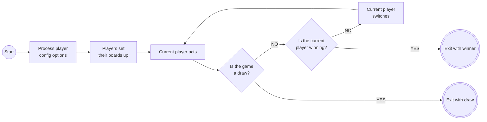
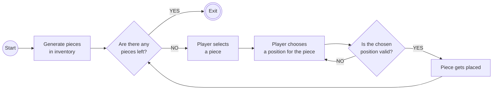
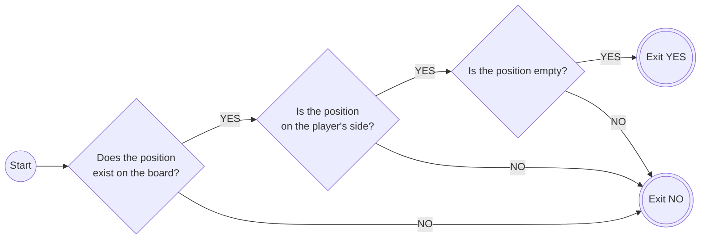
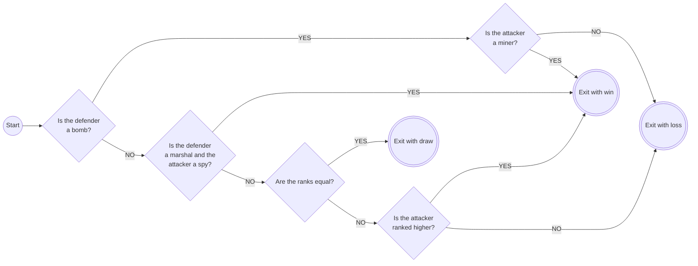
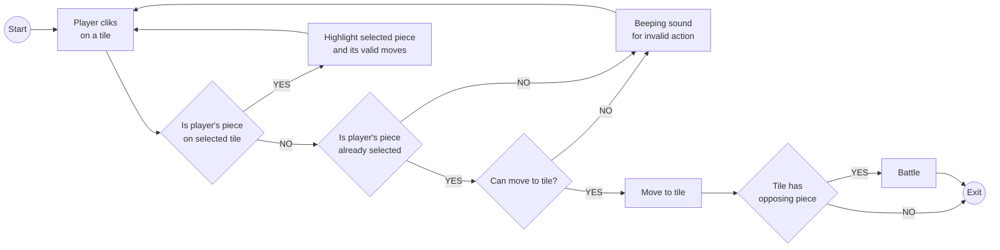
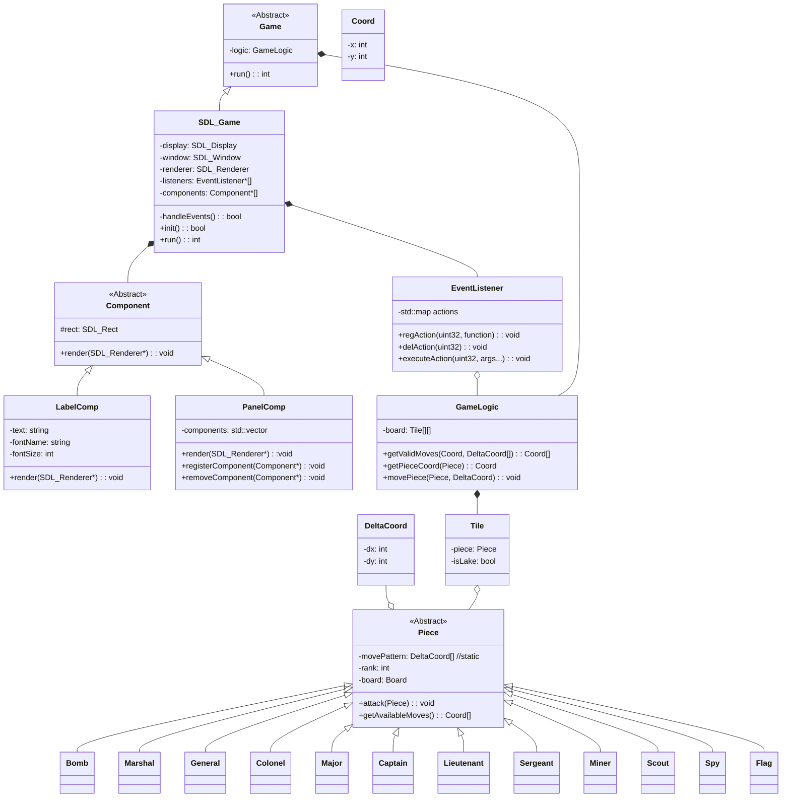

# cpp-stratego

## Diagrams ##

### Flowcharts ###

#### Top level game process ####

#### Board setup ####

#### Is the chosen position valid? ####

#### Battle (attacker perspective) ####

#### Current player act ####

### Class Diagrams ###

