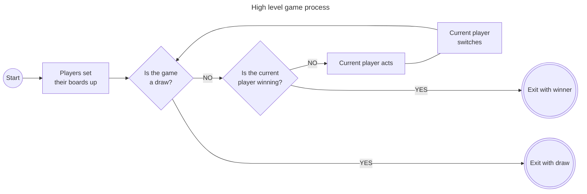
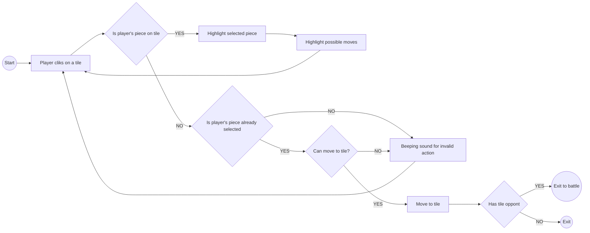

# cpp-stratego

## Diagrams ##

### Flowcharts ###

```mermaid

---
title: High level game process
---

flowchart LR
START(("Start"))
boardSetup["Players set 
            their boards up"]
isDraw{"Is the game 
        a draw?"}
isPlayerWin{"Is the current
            player winning?"}
playerActs["Current player acts"]
playerSwitch["Current player
              switches"]
END0((("Exit with winner")))
END1((("Exit with draw")))

START --> boardSetup
boardSetup --> isDraw
isDraw -- NO --> isPlayerWin
isDraw -- YES -----> END1
isPlayerWin -- NO --> playerActs
isPlayerWin -- YES ----> END0
playerActs --- playerSwitch
playerSwitch --> isDraw
```

#### Current player act ####

```mermaid
flowchart LR
START((Start))
END((Exit))

clickTile[Player cliks on a tile]
isPlayersPieceOnTile{Is player's piece on tile}
isPlayersPieceSelected{Is player's piece already selected}

beep[Beeping sound for invalid action]

selectPiece[Highlight selected piece]
highlightMoves[Highlight possible moves]


canMoveToTile{Can move to tile?}
hasTileOpponent{Has tile oppont}
exitToBattle((Exit to battle))
moveToTile[Move to tile]

START --> clickTile
clickTile --> isPlayersPieceOnTile
isPlayersPieceOnTile -- NO --> isPlayersPieceSelected
  isPlayersPieceSelected -- NO --> beep
  beep --> clickTile
  isPlayersPieceSelected -- YES --> canMoveToTile
    canMoveToTile -- NO --> beep
    canMoveToTile -- YES --> moveToTile
    moveToTile --> hasTileOpponent
      hasTileOpponent -- YES --> exitToBattle
      hasTileOpponent -- NO --> END
isPlayersPieceOnTile -- YES --> selectPiece
  selectPiece --> highlightMoves 
  highlightMoves --> clickTile
```
### Class Diagrams ##