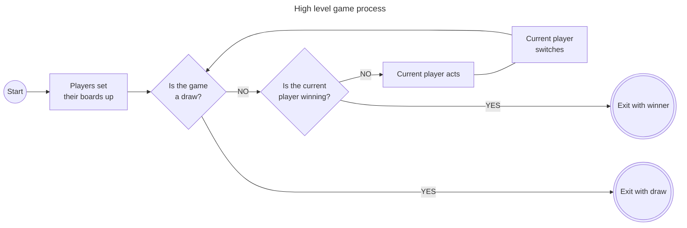
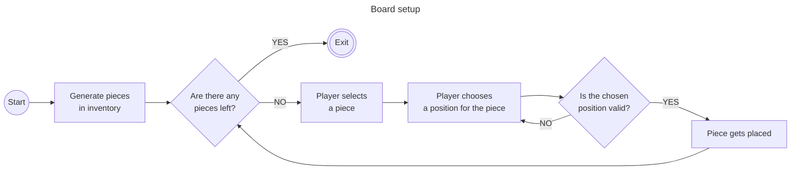

# cpp-stratego

## Diagrams ##

### Flowcharts ###

```mermaid

---
title: High level game process
---

flowchart LR
START(("Start"))
boardSetup["Players set 
            their boards up"]
isDraw{"Is the game 
        a draw?"}
isPlayerWin{"Is the current
            player winning?"}
playerActs["Current player acts"]
playerSwitch["Current player
              switches"]
END0((("Exit with winner")))
END1((("Exit with draw")))

START --> boardSetup
boardSetup --> isDraw
isDraw -- NO --> isPlayerWin
isDraw -- YES -----> END1
isPlayerWin -- NO --> playerActs
isPlayerWin -- YES ----> END0
playerActs --- playerSwitch
playerSwitch --> isDraw

```

```mermaid

---
title: Board setup
---

flowchart LR
START(("Start"))
END0((("Exit")))
genPieces["Generate pieces 
          in inventory"]
selectPiece["Player selects
            a piece"]
choosePos["Player chooses 
           a position for the piece"]
isValidPos{"Is the chosen 
            position valid?"}
placePiece["Piece gets placed"]
isInvEmpty{"Are there any 
            pieces left?"}

START --> genPieces
genPieces --> isInvEmpty
isInvEmpty -- NO --> selectPiece
isInvEmpty -- YES --> END0
selectPiece --> choosePos
choosePos --> isValidPos
isValidPos -- NO --> choosePos
isValidPos -- YES --> placePiece
placePiece --> isInvEmpty


```
### Class Diagrams ###